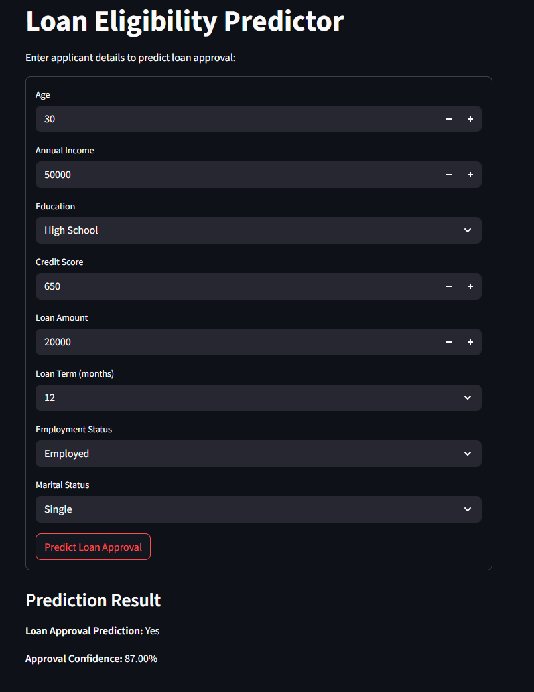

# Loan Eligibility Predictor

This project predicts whether a loan applicant should be granted a loan based on their details using machine learning models.

## Features
- Synthetic dataset generation
- Data preprocessing and feature engineering
- Model training: Logistic Regression and Random Forest
- Model evaluation: Confusion matrix, ROC curve
- Command-line interface and Streamlit web app for predictions

## Files
- `app.py`: Streamlit web app for loan prediction (**main app**)
- `loan_synthetic_data.py`: Script to generate the synthetic dataset.
- `loan_synthetic_data.csv`: The generated dataset (optional, but recommended for reproducibility).
- `loan_preprocess_and_model.py`: Preprocesses data, trains models, evaluates, and saves them.
- `rf_model.joblib`, `logreg_model.joblib`: Saved trained models (`rf_model.joblib` is used by the app).
- `label_encoder.joblib`: Saved label encoder for target variable.
- `roc_curve.png`: ROC curve plot for model evaluation (optional).
- `loan_predict_cli.py`: CLI tool for user input and loan prediction (optional).
- `README.md`: Project instructions and documentation.
- `requirements.txt`: Python dependencies.
- `.gitignore`: (Recommended) To exclude unnecessary files like `__pycache__/`, `.ipynb_checkpoints/`, etc.
- `photos/`: Folder for screenshots and output images.

## Setup
1. Clone the repository.
2. Install dependencies:
   ```bash
   pip install -r requirements.txt
   ```
3. Generate the dataset (if not present):
   ```bash
   python loan_synthetic_data.py
   ```
4. Preprocess data and train models:
   ```bash
   python loan_preprocess_and_model.py
   ```

## Usage
### Streamlit Web App
Run the following command and use the web interface:
```bash
streamlit run app.py
```

### Command-Line Interface (Optional)
Run the CLI tool and follow the prompts:
```bash
python loan_predict_cli.py
```

## Output Screenshot
Below is a sample output from the Streamlit app:



## Requirements
See `requirements.txt` for Python package dependencies.

## Recommended .gitignore
```
__pycache__/
*.pyc
*.pyo
*.joblib
*.png
*.csv
.ipynb_checkpoints/
.env
.DS_Store
``` 
